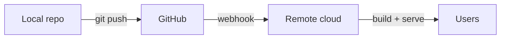
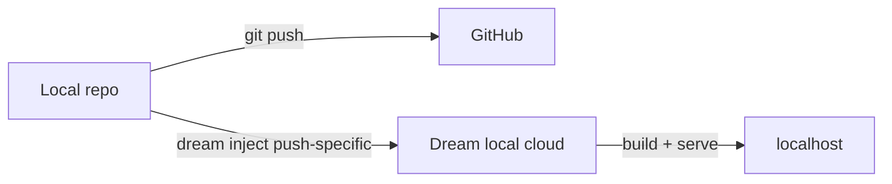

# Understanding Taubyte Architecture

## When to use

- "What is `tau` vs `dream`?"
- "Why didn't my push show up on the cloud?"
- "Do I need GitHub for this?"
- "What repos does a Taubyte project need?"
- "Should I use Dream or a remote cloud?"
- Onboarding a new project / first-time orientation.

## One-paragraph mental model

Taubyte is **git-native**: GitHub is the source of truth, and clouds are build+serve consumers of what's pushed. `tau` is the CLI that connects to a cloud (remote or local) to create/manage projects and resources by writing config files into a config repo. `dream` is a miniature Taubyte cloud you can run on your laptop; `tau` can target it as a local cloud. **Remote** clouds build automatically via GitHub webhooks; **Dream** local clouds are triggered with `dream inject` because no public webhook can reach localhost.

## Cloud types

| Type | Where it runs | How builds trigger |
| --- | --- | --- |
| Remote | Real Taubyte infrastructure | GitHub webhook (automatic on push) |
| Local (Dream) | Laptop, hosted by `dream` | `dream inject push-all` / `push-specific` after GitHub push |

`tau` connects to either via:

- `tau select cloud --universe <name>` → local Dream cloud (the universe is the Dream-side context).
- `tau select cloud --fqdn <fqdn>` → remote cloud.

## Source-of-truth repos

A Taubyte project always has **two mandatory repos** on GitHub, plus optional ones per resource:

```text
GitHub: <org>/
├── tb_<project>           # Config repo (mandatory) — YAML resource definitions
├── tb_code_<project>      # Code repo (mandatory) — inline serverless function source
├── tb_code_<project>_<site>     # Optional, one per website
└── tb_code_<project>_<lib>      # Optional, one per library
```

- **Config repo**: contains `config.yaml` plus folders like `domains/`, `functions/`, `applications/<app>/databases|storage|messaging|services|functions/`, `websites/`, `libraries/`. **Modify only via `tau`** — manual edits can break the schema and cause `tau validate config` failures.
- **Code repo**: holds inline function source if you choose the inline approach.
- **Website / library repos**: each website and each library lives in its own repository.

## Build flow

### Remote (webhook-driven, default for production)



### Local Dream (inject-driven)



Both flows still go through GitHub. `dream inject` simulates the webhook locally because Dream can't receive a public webhook.

## Local on-disk layout (after `tau new project`)

```text
/path/to/projects/<project>/
├── config/             # cloned from tb_<project>
├── code/               # cloned from tb_code_<project>
├── websites/<repo>/    # cloned when website is imported
└── libraries/<repo>/   # cloned when library is imported
```

## Hard rules

- GitHub is the source of truth. **Never** push directly to the cloud bypassing git.
- Config repo structure is owned by `tau`. **Don't hand-edit** YAML in `config/` unless explicitly debugging schema (and even then, `tau` should rewrite it).
- Project name → use **snake_case** (dashes break `tau validate config` with `invalid variable name`). See [bootstrapping-taubyte-projects](../bootstrapping-taubyte-projects/SKILL.md).
- Each website/library is its **own** GitHub repo.

## Related skills

- `starting-dream-locally` — bring up a Dream cloud
- `bootstrapping-taubyte-projects` — create the config + code repos
- `triggering-dream-builds` — local-cloud build trigger
- `pushing-taubyte-projects` — push config/code/website/library to GitHub via `tau`
